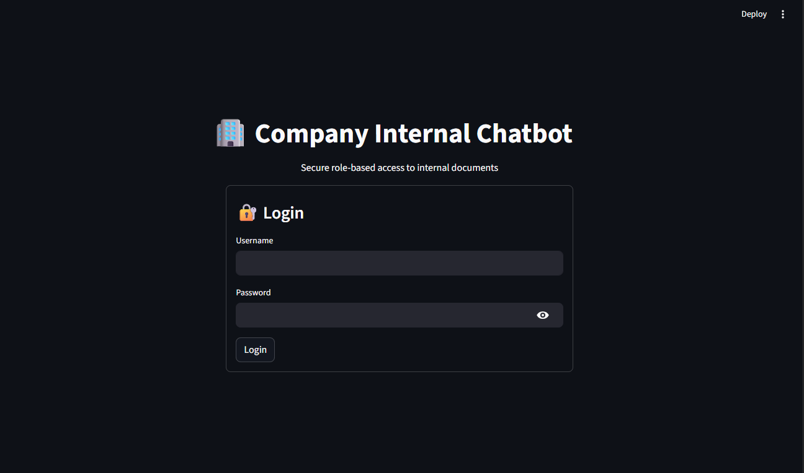

# 🏢 Company Internal Chatbot with Role-Based Access Control (RBAC)

A secure **Company Internal Chatbot** built using **Retrieval-Augmented Generation (RAG)** and **strict Role-Based Access Control (RBAC)**.  
The system ensures that users can retrieve **only role-authorized internal company information**, preventing cross-department data leakage while maintaining transparency, traceability, and grounded AI responses.

---

## 🚀 Project Overview

This project implements a **secure, role-aware RAG pipeline** for internal company documents, fully aligned with the official project specification PDF.

The system enforces **authentication, authorization, secure retrieval, grounded generation, confidence scoring, and source attribution** across all user queries.

---

## 🔐 Key Guarantees

- 🔒 Strict **role-based document access**
- 🛡️ Zero cross-department or privilege-escalation leakage
- 🧠 Retrieval-Augmented Generation (RAG)
- 📎 Source attribution for every answer
- 📊 Confidence-scored responses
- 🧾 Access audit logging
- 🚫 Hallucination prevention (no external knowledge)
- 📄 Company-wide documents accessible to all employees

---

### 👥 Supported Roles

- **Employees**
- **Finance**
- **HR**
- **Marketing**
- **Engineering**
- **C-Level**

---

### 📄 Department Access Matrix

| Role        | Finance Docs | HR Docs | Marketing Docs | Engineering Docs | General Docs |
|------------|--------------|---------|----------------|------------------|--------------|
| Employees  | ❌ No        | ❌ No   | ❌ No          | ❌ No            | ✅ Yes       |
| Finance    | ✅ Yes       | ❌ No   | ❌ No          | ❌ No            | ✅ Yes       |
| HR         | ❌ No        | ✅ Yes  | ❌ No          | ❌ No            | ✅ Yes       |
| Marketing  | ❌ No        | ❌ No   | ✅ Yes         | ❌ No            | ✅ Yes       |
| Engineering| ❌ No        | ❌ No   | ❌ No          | ✅ Yes           | ✅ Yes       |
| C-Level    | ✅ Yes       | ✅ Yes  | ✅ Yes         | ✅ Yes           | ✅ Yes       |

---

## 📂 Data Organization

```bash
data/
└── Fintech-data/
    ├── finance/
    ├── marketing/
    ├── hr/
    ├── engineering/
    └── general/

```
---

## 📄 Supported File Formats

The system supports multiple document formats commonly used in internal company knowledge bases:

- **Markdown (`.md`)** – Policy documents, reports, technical notes
- **CSV (`.csv`)** – Structured data such as financial tables or analytics
- **Text (`.txt`)** – Plain text documentation and logs

All supported formats are parsed and normalized before being ingested into the vector database.

---

## 🏗️ Architecture Summary

### Core Components

#### 🔐 Authentication & Authorization
- JWT-based authentication
- SQLite user database
- bcrypt password hashing
- Dependency-based RBAC enforcement

#### 🧹 Document Preprocessing Pipeline
- File parsing (```.md```, ```.csv```, ```.txt```)
- Text cleaning and normalization
- Token-safe chunking (model-aware)
- Role metadata injection per chunk
- Department-wise ingestion tracking

#### 🧠 Vector Store
- SentenceTransformer-based embeddings (```all-MiniLM-L6-v2```)
- Persistent **ChromaDB** storage
- Metadata preserved for every embedded chunk

#### 🔎 Secure Retriever
- High-recall semantic similarity search
- **Post-retrieval RBAC enforcement**
- Context relevance filtering
- Duplicate and low-signal chunk suppression

#### 🤖 LLM Integration (RAG)
- Gemini API (free-tier)
- Strictly grounded prompts
- No external knowledge usage
- Safe fallback responses

#### 📎 Source Attribution
- Document-level citation extraction
- Deduplicated sources
- Transparent answer provenance

#### 📊 Confidence Scoring
- Similarity-score–based confidence
- Deterministic and explainable scoring

#### 🧾 Audit Logging
- Logs user, role, query, and result count
- Stored securely in backend auth module

---

## 🔄 Processing Pipeline

```text
User Login  
↓  
JWT Authentication  
↓  
RBAC Validation  
↓  
Secure Vector Retrieval  
↓  
RBAC Filtering  
↓  
Context Construction  
↓  
LLM Answer Generation  
↓  
Source Attribution  
↓  
Confidence Scoring  
↓  
Final Secure Response  
```

---

## 🔐 Security Model (RBAC)

Role-Based Access Control (RBAC) is enforced at the **retrieval layer**, ensuring that access control is applied even after semantic similarity search.

### Key Security Principles
- Authentication via JWT
- Authorization via RBAC metadata
- Retrieval-time access enforcement
- Generation-time grounding enforcement
- No external knowledge leakage
- Safe fallback when data is unavailable

### This Prevents
- Privilege escalation
- Hallucinated answers
- Cross-role inference
- Unauthorized document access
- Metadata tampering

---

## 📌 Milestone 1 :  Environment Setup & Document Preprocessing
- Project environment setup
- Role → department access mapping
- Document parsing (`.md`, `.csv`, `.txt`)
- Text cleaning and normalization
- Token-safe chunking

## 📌 Milestone 2 :  Vector Database & Secure Retrieval
- SentenceTransformer embeddings (MiniLM)
- Persistent ChromaDB vector store
- High-recall semantic retrieval
- RBAC-safe post-retrieval filtering
- Duplicate chunk suppression

## 📌 Milestone 3 – Authentication, RBAC API & Secure RAG
- FastAPI backend
- JWT-based authentication
- SQLite user database
- bcrypt password hashing
- RBAC-protected /query API
- LLM-powered RAG responses
- Source attribution
- Confidence scoring
- Audit logging
- Hallucination prevention

### ✅ Milestone 4: Frontend UI & End-to-End Integration 
- Streamlit-based chat UI
- Secure login workflow
- Role-aware sidebar
- Interactive chat interface
- Citation display
- Confidence-aware responses
- End-to-end backend ↔ frontend integration
- Verified RBAC behavior via UI
---

## 📊 Current Results (Verified from Demo Runs)

### ✅ Authorized Query Example

```text
User Role : Finance
Query     : financial report revenue

```

- Finance-only documents retrieved  
- Correct values returned  
- Sources shown  
- Confidence > 0  

✔️ Only finance-authorized content was returned.

### 🚫 Unauthorized Query Example

```text
User Role : Marketing
Query     : employee salary

```

- Zero results returned  
- Confidence = 0.0  
- Access correctly blocked  

✔️ Unauthorized access was correctly blocked with zero results.

### 🚫 External Knowledge Query (Blocked)
```text
Query : What is the name of PM of India?
```

Response:
```text
The requested information is not available in the provided documents.
```

✔️ Hallucination prevented
✔️ Grounding enforced
---


## 🧰 Tech Stack

The project is built entirely using free and open-source technologies along with free-tier AI APIs, ensuring accessibility, reproducibility, and ease of deployment.

---

### 🖥️ Backend

Component | Technology
Web Framework | FastAPI
API Server | Uvicorn
Authentication | JWT (python-jose)
Password Security | bcrypt (passlib)
Database | SQLite (SQLAlchemy ORM)
Access Control | Dependency-based RBAC enforcement
Environment Config | python-dotenv

---

### 🧠 Retrieval & AI

Component | Technology
Embedding Model | sentence-transformers/all-MiniLM-L6-v2
Vector Database | ChromaDB (Persistent Storage)
LLM | Gemini API (gemini-2.5-flash)
RAG Strategy | Secure Retrieval-Augmented Generation (RBAC-aware)
Prompt Engineering | Custom grounded prompt templates
Confidence Scoring | Similarity-score–based scoring

---

### 📄 Data Processing

Component | Technology
Document Formats | Markdown (.md), CSV (.csv), Text (.txt)
Text Processing | Regex cleaning + SentenceTransformer tokenizer
Chunking Strategy | Token-aware sliding window chunking
Metadata Injection | Role-based department metadata per chunk
Data Handling | Pandas

---

### 🖥️ Frontend

Component | Technology
Web Interface | Streamlit
User Interaction | Chat-based conversational UI
Authentication Flow | JWT-based secure login
Source Display | Inline source citations
API Communication | Requests (HTTP client)

---

### 🔧 Dev & Utilities

Component | Technology
Language | Python 3.11+
Version Control | Git & GitHub
Logging | Python Logging (audit logging enabled)
HTTP Client | Requests
ORM | SQLAlchemy
Environment Management | venv (Virtual Environment)

---

### ☁️ Deployment (Planned)

Component | Technology
Hosting | Local (Current) → Cloud Deployment (Pending)
Package Management | pip + requirements.txt
Environment Variables | .env configuration
Production Server | Uvicorn (ASGI)


## 🔐 RBAC Role Matrix

The system enforces **strict Role-Based Access Control (RBAC)** to ensure users can only access information permitted by their role.

Each document chunk is tagged with role metadata, and access is enforced at both the **API layer** and **vector retrieval layer**.

---

## 🧪 Running the Project
From the project root:
### Backend 
```bash
python -m uvicorn backend.main:app --reload
```
- API: http://127.0.0.1:8000

- Docs: http://127.0.0.1:8000/docs


### Frontend 
```bash
streamlit run frontend/streamlit_app.py  
```
- UI: http://localhost:8501

## 📁 Project Structure (Current)
```bash
Chatbot/
├── backend/
│   ├── auth/                    # Authentication & authorization
│   │   ├── auth_utils.py        # JWT creation & verification
│   │   ├── password_utils.py    # bcrypt password hashing
│   │   ├── dependencies.py      # Auth dependency (JWT → user)
│   │   ├── audit_logger.py      # Access audit logging
│   │   └── access_audit.log     # Auth access logs
│   │
│   ├── db/                      # User database (SQLite)
│   │   ├── database.py          # DB engine & session
│   │   ├── models.py            # User table (username as PK)
│   │   ├── user_repository.py   # DB access layer
│   │   ├── init_db.py           # Add/Delete users interactively
│   │   └── users.db             # SQLite user database
│   │
│   ├── rag/                     # RAG + RBAC pipeline
│   │   ├── rbac.py              # Role → document access rules
│   │   ├── preprocessing.py     # Parse, clean, chunk, metadata
│   │   ├── vector_store.py      # Embeddings + ChromaDB
│   │   ├── retriever.py         # Secure RBAC-aware retrieval
│   │   ├── citation_utils.py    # Source attribution
│   │   ├── confidence_utils.py  # Confidence scoring
│   │   ├── rag_pipeline.py      # Full RAG orchestration
│   │   ├── pipeline.py          # Vector-store build pipeline
│   │   └── __init__.py
│   │
│   ├── llm/                     # LLM integration
│   │   ├── llm_client.py        # HuggingFace LLM wrapper
│   │   ├── prompt_templates.py  # Grounded prompt templates
│   │   └── __init__.py
│   │
│   ├── models/
│   │   └── user.py              # Pydantic User model
│   │
│   ├── routes/
│   │   ├── auth_routes.py       # /login endpoint
│   │   └── chat_routes.py       # /query (RAG + RBAC)
│   │
│   └── main.py                  # FastAPI entry point
│
├── data/
│   └── Fintech-data/
│       ├── finance/
│       ├── marketing/
│       ├── hr/
│       ├── engineering/
│       └── general/
│
├── frontend/                 # Streamlit User Interface
│   ├── api_client.py         # Connects UI to Backend
│   └── streamlit_app.py      # Main UI Logic
│
├──  .env                     # Gemini Api and Backend Url
├──  requirements.txt         # dependencies
└── README.md
```

## ✅ Evaluation Criteria Mapping

The project has been implemented to explicitly meet all evaluation criteria defined in the project specification. The table below maps each criterion to the corresponding implementation in the system.

---

### 📊 Evaluation Matrix

| Milestone | Evaluation Metric | Target | Implementation Evidence |
|----------|------------------|--------|--------------------------|
| Milestone 1 | Document parsing and metadata accuracy | 100% documents parsed, accurate role mapping | Preprocessing pipeline with validation tests and role-based metadata tagging |
| Milestone 2 | Role-based access and search quality | Zero unauthorized access, retrieval latency < 500ms | RBAC enforced at API and vector search level using metadata filtering |
| Milestone 3 | Authentication and RAG functionality | Secure auth, end-to-end response < 3s | JWT authentication, RAG pipeline with relevance guard and confidence scoring |
| Milestone 4 | Frontend usability and deployment readiness | Intuitive UI, complete documentation, working demo | Streamlit UI, structured README, demo-ready GitHub repository |

---

### 🔍 Verification Highlights

- **Zero Unauthorized Access**  
  Retrieval is filtered by accessible_roles before context is passed to LLM.

- **Strict Grounding**  
  If no relevant documents are retrieved, system returns fallback response.

- **End-to-End Role Testing**  
  Tested across finance, hr, marketing, engineering, employees, and c_level.

- **Confidence Transparency**  
  Responses include similarity-based confidence scoring.

  This ensures the project is not only functional but also **fully aligned with evaluation expectations**.

---

## 🚧 Limitations & Future Enhancements

While the system successfully meets all project requirements, there are certain limitations and opportunities for improvement.

---

### ⚠️ Current Limitations

- **Single-Node Deployment**  
  The system runs on a single machine and is not distributed across multiple servers.

- **LLM Response Quality**  
  The quality of generated answers depends on the capabilities of the FLAN-T5 model, which may struggle with very complex or ambiguous queries.

- **Static Role Configuration**  
  User roles and permissions are defined statically and require manual updates.

- **Limited Language Support**  
  The system currently supports English-language queries only.

---

### 🚀 Future Enhancements

- **Advanced Access Control**
  - Introduce dynamic role management via an admin dashboard.
  - Support fine-grained permissions at document or section level.

- **Model Improvements**
  - Integrate more powerful LLMs (e.g., LLaMA variants) for improved reasoning.
  - Enable model selection based on query complexity.

- **Scalability Enhancements**
  - Deploy using Docker and container orchestration.
  - Introduce distributed vector databases for large-scale document sets.

- **Monitoring & Analytics**
  - Add dashboards for access analytics and query trends.
  - Track model performance and confidence score distributions.

- **Multi-Language Support**
  - Enable document ingestion and querying in multiple languages.

These enhancements can further improve scalability, usability, and enterprise readiness.

---

## 🖼️ Screenshots

The following screenshots demonstrate the key functionalities of the system, including authentication, role-based access control, and RAG-based responses.

---

### 🔐 User Login Interface
Shows the Streamlit-based login screen where users authenticate using their credentials.



---

### 🚫 Role-Based Access Control (RBAC) – Access Denied (Wrong IDP)
Illustrates access denial when a user attempts to authenticate or query the system using an incorrect or unauthorized Identity Provider (IDP).


---

### 💬 Chat Interface with RAG Response
Demonstrates a successful query response generated using the RAG pipeline, including:
- Context-aware answer
- Source document attribution


---

## 🔑 Demo Credentials

The system includes preconfigured demo users:


| Username  | Password | Role        |
|-----------|----------|-------------|
| carol     | carol123 | HR          |
| alice     | alice123 | Finance     |
| bob       | bob123   | Marketing   |
| dave      | dave123  | Engineering |
| eve       | eve123   | Employees   |
| admin     | admin123 | C-Level     |

User accounts can be created or deleted using the interactive database initialization utility:

`python -m backend.app.db.init_db`

This command allows administrators to securely manage user credentials and role assignments from the command line.

---

## 🔒 Security Considerations

- **JWT-Based Authentication**  
  All protected endpoints require a valid token.

- **Password Hashing**  
  Passwords hashed using bcrypt before storage.

- **Multi-Layer RBAC Enforcement**  
  - API dependency layer  
  - Vector retrieval filtering  
  - RAG pipeline validation  

- **No Data Leakage**  
  Users cannot access documents outside assigned roles.

- **Audit Logging**  
  All access attempts logged in access_audit.log.

This ensures secure handling of sensitive internal company data.

---

## 📌 Assumptions

- All users are internal company users.
- Documents are trusted and pre-validated.
- Role assignments are managed by an administrator.
- Deployment occurs in a controlled internal environment.

---

## 🏁 Conclusion

This project demonstrates the design and implementation of a secure, role-aware internal chatbot using Retrieval-Augmented Generation (RAG).

Key Highlights:
- End-to-end RBAC enforcement
- Secure JWT authentication
- Gemini-powered grounded responses
- Source attribution with transparency
- Confidence scoring for reliability
- Modular, scalable architecture
- Complete frontend integration

The system satisfies all milestone requirements and provides a strong foundation for enterprise-grade internal knowledge assistants.

---

**Author:** Arman Redhu  
**Project:** Company Internal Chatbot with RBAC & RAG  
**Tech Stack:** FastAPI · Streamlit · ChromaDB · Sentence Transformers · Gemini API